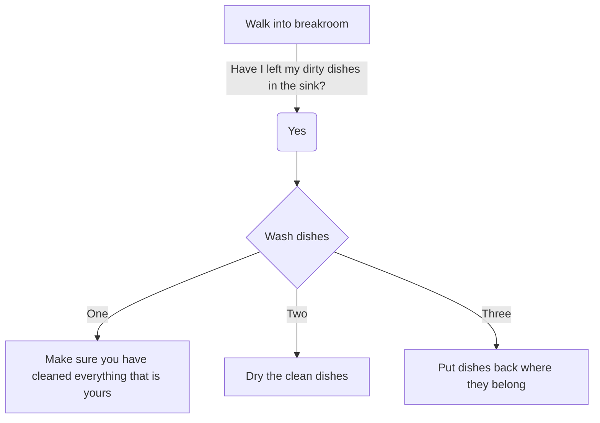

```mermaid
flowchart TD
    A[Walk into breakroom] -->|Have I left my dirty dishes in the sink? | B(Yes)
    B --> C{Wash dishes}
    C -->|One| D[Make sure you have cleaned everything that is yours]
    C -->|Two| E[Dry the clean dishes]
    C -->|Three| F[Put dishes back where they belong]
```
